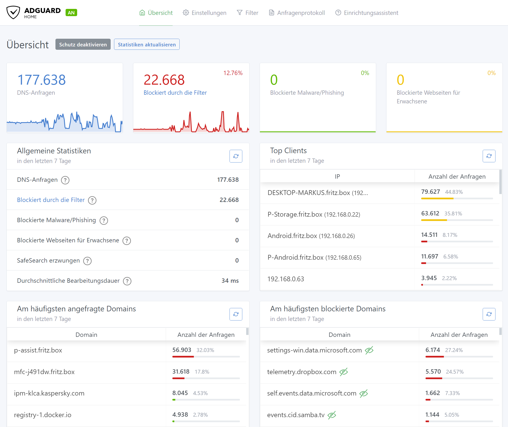
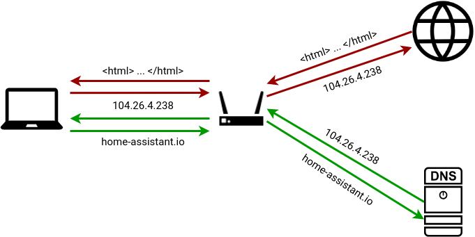
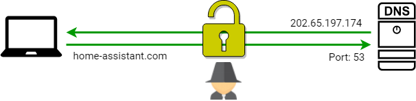
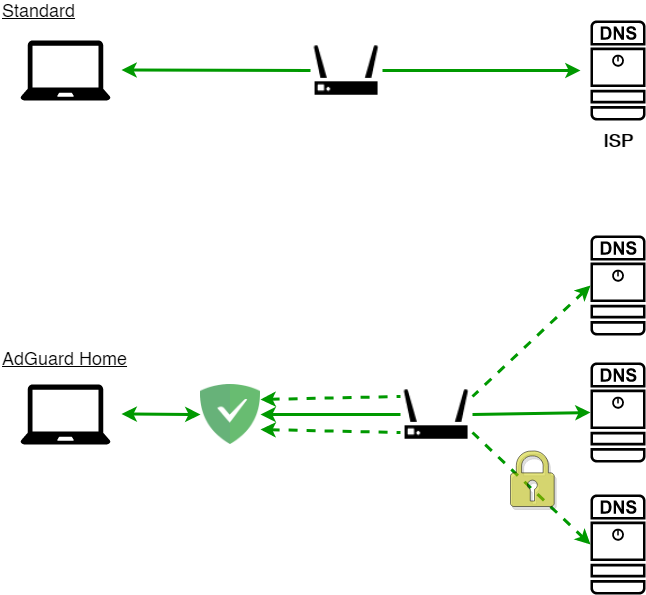
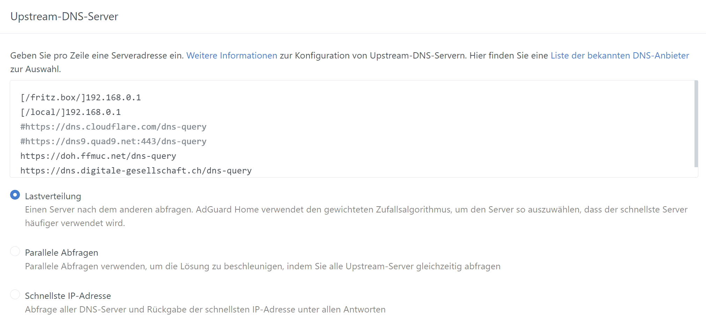
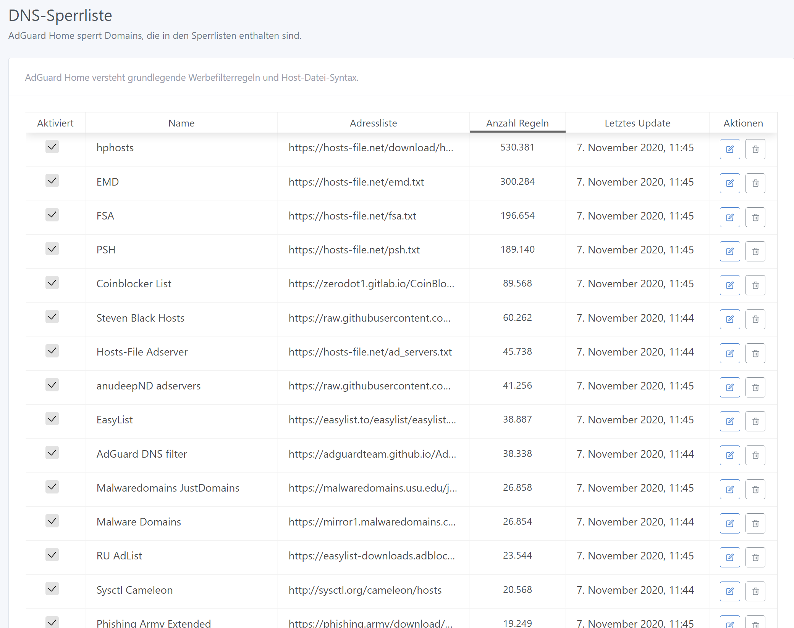
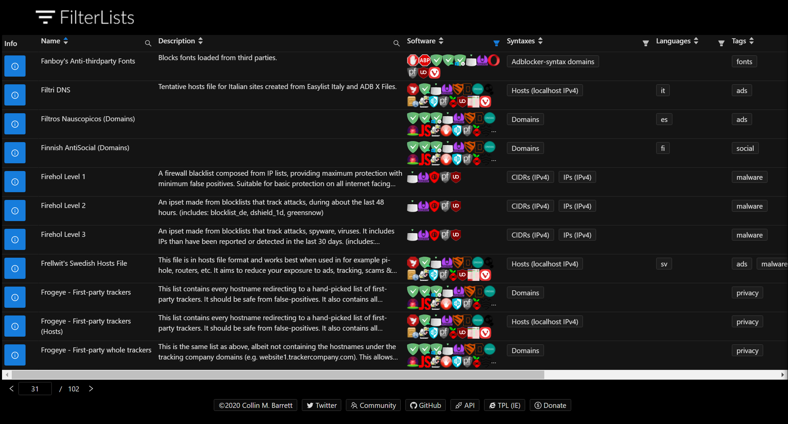
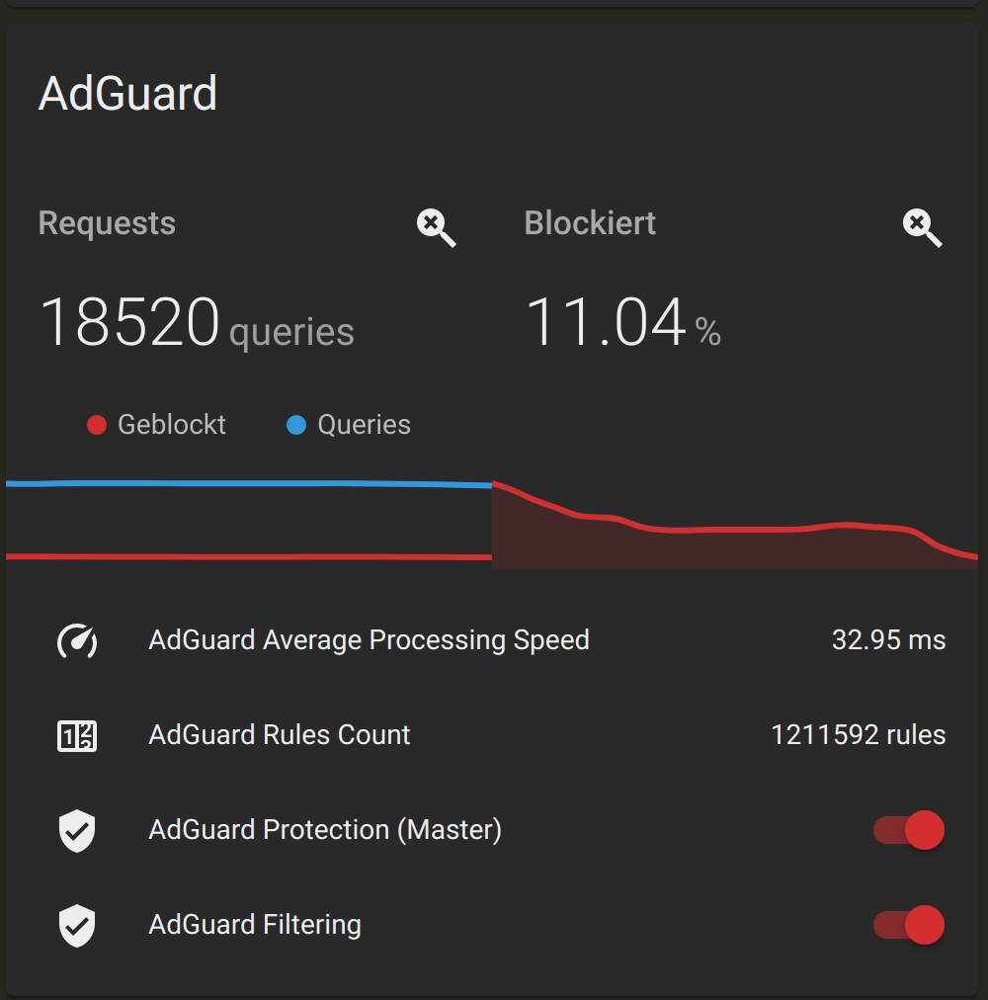

:css: style.css

.. title:: AdGuard Home Home Assistant Addon

----

:data-x: r2400

AdGuard Home Addon
==================

Ein DNS/AdBlocker im Heim-Netzwerk

Markus Pöschl

----

Agenda
------

* AdGuard Home
* Wie funktioniert ein DNS?

  * Was ist DoT/DoH?

* Das Addon im Einsatz
* Wo gibt es gute Filterlisten?

----

AdGuard Home
------------

* Blockiert, Protokolliert DNS Anfragen von

  * Werbung
  * Tracking
  * NSFW

* Verwaltung benutzter DNS Server
* Unterstützt "DNS over TLS" (DoT) und "DNS over HTTPS" (DoH)

* Installation im Netzwerk
* Keine Veränderung auf den Endgeräten

* Integrierte Listen für Malware/Pishing und Erwachsenen-Content

.. note::

  * AdGuard Home als eigener DNS Server im Netzwerk
  * Geeignet für IoT, da keine Veränderung an Gerät
  * Pi-Hole ist ähnlich, bietet allerding nicht DoT oder DoH out of the box

----

DNS ?
-----

* "Domain Name System"
* Zuständig für Domain-Namen
* Vergleichbar mit dem Telefonbuch
* Internetanbeiter gibt eigenen als Standard vor
* Werden teilweise für Zensur benutzt

Öffentliche DNS Server:

* `8.8.8.8` - Google Public DNS
* `1.1.1.1` - Cloudflare DNS
* `46.182.19.48` - digitalcourage.de

----

:data-x: r0
:data-y: r1200

DNS ist sicher?
---------------

Standardmäßig: **Nein**

* Anfragen sind nicht verschlüsselt
* Lesbar für alle
* Angriff durch falsche Antworten

.. note::

  * Mitschneiden auf DNS Port 53 -> Surfverhalten
  * Anderer Server für google.de

----

DNS over TLS (DoT)
------------------

* Verschlüsselung der Namensauflösung mit TLS
* Kein Mitlesen möglich
* Anfragen verraten nur das es eine DNS Anfrage ist

.. note::

  * DNS-Anfragen Typ durch Port 853 ersichtlich

----

DNS over HTTPS (DoH)
--------------------

* Verschlüsselung der Namensauflösung mittels einer HTTPS Verbindung
* Kein Mitlesen möglich
* Wenn der DNS Server auch auf Port 433 läuft, ist die Anfrage als HTTPS-Anfrage "getarnt"

----

:data-x: r2400
:data-y: r0

AdGuard Home Addon
------------------

* Eigener DNS im Heimnetz
* Blockierung durch Nicht-Auflösen von DNS-Adressen

Installationshinweise im Supervisor Addon-Store beachten!

.. note::

  * Router verteilt DNS Server bei Netzwerkanmeldung mit
  * HA muss Namen auflösen, deshalb eigener DNS nötig
  * Im Router als Netzwerk-DNS eintragen

----

:data-x: r0
:data-y: r1200

AdGuard Home DNS Server
-----------------------

* Mehrere DNS-Server einstellbar
* DoT/DoH Unterstützung
* DNS für bestimmte Domains festlegen

* Liste an DNS Servern: https://dnscrypt.info/public-servers/

|local_adguard_addon|

----

AdGuard Home Filterlisten
-------------------------

* Integration von `hosts` Dateien oder AdGuard Syntax
* Viele Blocklisten öffentlich verfügbar
* Filterlisten sollten regelmäßig gepflegt werden

|local_adguard_addon|

----

:data-x: r2400
:data-y: r0

Filterlisten finden
-------------------

* Filterlisten in Foren von AdGuard Home / Pi-Hole
* https://filterlists.com/ - listet über 400 Listen
* https://firebog.net/ - ca. 100 Listen handverlesen
* Adblocker-Einstellungen im Browser

----

Integration Home Assistant
--------------------------

* Darstellung / Services durch Integrationen

Fazit
-----

* Einfache Installation
* Privacy Zugewinn
* Tracking- / Werbe-freies Netzwerk
* Standalone Installation als Addon

.. |local_adguard_addon| raw:: html

   <a href="https://p-assist.fritz.box/a0d7b954_adguard" target="_blank">Demo</a>
